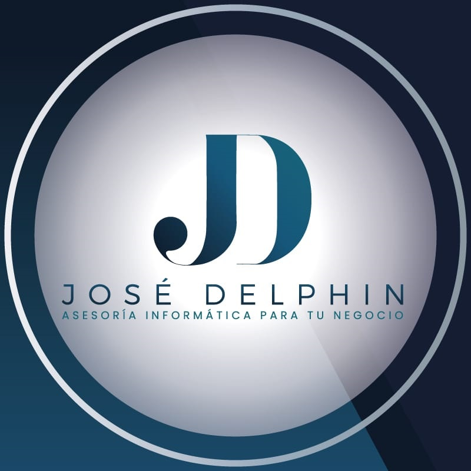

<a name="Capstone-Project"></a>

<div align="center">

  
  <br/>

  <h3><b>Jose Alejandro Delphin Puente</b></h3>
  <h3><b>Capstone Project - Web Courses</b></h3>

</div>

# 📗 Table of Contents

- [📖 About the Project](#about-project)
    - [🛠 Built With](#built-with)
    - [Tech Stack](#tech-stack)
    - [Key Features](#key-features)
- [🧑🏻‍💻 Live Demo](#live-demo)
- [💻 Getting Started](#getting-started)
  - [Prerequisites](#prerequisites)
  - [Clone](#prerequisites)
- [👥 Authors](#authors)
- [🔭 Future Features](#future-features)
- [🤝 Contributing](#contributing)
- [⭐️ Show your support](#support)
- [🙏 Acknowledgements](#acknowledgements)
- [❓ FAQ](#faq)
- [📝 License](#license)

# 📖 Jose Alejandro Delphin Puente - Capstone Project <a name="about-project"></a>

> A Capstone project website is a way to show one of my works and let others know about How looks a project developed with my new skill. It's a website to show a concert data.

## 🛠 Built With <a name="built-with"></a>
 - Visual Studio Code
 - HTML
 - CSS
 - Javascript

### Tech Stack <a name="tech-stack"></a>

<details>
  <summary>Client</summary>
  <ul>
    <li><a href="https://en.wikipedia.org/wiki/HTML">Html</a></li>
    <li><a href="https://en.wikipedia.org/wiki/CSS">Css</a></li>
    <li><a href="https://en.wikipedia.org/wiki/CSS">Javascript</a></li>
  </ul>
</details>

<!-- Features -->

#### Key Features <a name="key-features"></a>

- **Mobile version**

  - **Hamburger menu**
  - **Presentation section**
  - **Works section**
  - **PopUp info about projects**
  - **About me section**
  - **Contact me**
  - **JS form validation**
  - **Local Storage Management**

  **Desktop version**

  - **Presentation section**
  - **Works section**
  - **PopUp info about projects**
  - **About me section**
  - **Contact me**
  - **JS form validation**
  - **Local Storage Management**

<p align="right">(<a href="#readme-top">back to top</a>)</p>

## 🧑🏻‍💻 Live Demo <a name="live-demo"></a>

<a href="https://adelphinsucasa.github.io/Capstone-Project/">Visit the Live Demo</a>

## 💻 Getting Started <a name="getting-started"></a>

To get a local copy up and use as a template for your own portafolio site, follow these steps.

### Prerequisites

In order to run this project you need: git installed in your system

### Clone

Clone this repository to your desired folder:

```sh
  git clone https://github.com/adelphinsucasa/Capstone-Project.git
```

<p align="right">(<a href="#readme-top">back to top</a>)</p>

<!-- AUTHORS -->

## 👥 Author <a name="authors"></a>

👤 **Author1**

: Jose Alejandro Delphin Puente
ve Venezuela 💓

- GitHub: [@githubhandle](https://github.com/adelphinsucasa)
- Twitter: [@twitterhandle](@josedelphin)
- LinkedIn: [LinkedIn](@adelphin)


👤 **Author2**

Original design idea by [Cindy Shin in Behance](https://www.behance.net/adagio07) is licensed under [CC BY-ND 2.0.](https://creativecommons.org/licenses/by-nd/2.0/).

<p align="right">(<a href="#readme-top">back to top</a>)</p>

## 🔭 Future Features <a name="future-features"></a>

- HTML + basic JavaScript Capstone

<p align="right">(<a href="#readme-top">back to top</a>)</p>

## 🤝 Contributing <a name="contributing"></a>

Contributions, issues, and feature requests are welcome!

<p align="right">(<a href="#readme-top">back to top</a>)</p>

## ⭐️ Show your support <a name="support"></a>

If you like this project please let me know

<p align="right">(<a href="#readme-top">back to top</a>)</p>

## 🙏 Acknowledgments <a name="acknowledgements"></a>

I would like to thank my family, all the partners and Microverse platform.

<p align="right">(<a href="#readme-top">back to top</a>)</p>

## ❓ FAQ <a name="faq"></a>

- **is there any restriction to put my name instead of the original author's name?**

  - You can delete my name and put yours without any problem.

- **[Can I change the original colors or assign a new color palette?
  ]**

  - [Yeah, no problem]

<p align="right">(<a href="#readme-top">back to top</a>)</p>

## 📝 License <a name="license"></a>

This project is [MIT](<a href="https://github.com/adelphinsucasa/Portfolio-Setup-and-mobile-first/blob/main/LICENSE">License</a>) licensed.

<a href="https://github.com/adelphinsucasa/Portfolio-Setup-and-mobile-first/blob/main/LICENSE">License</a>

<p align="right">(<a href="#readme-top">back to top</a>)</p>
